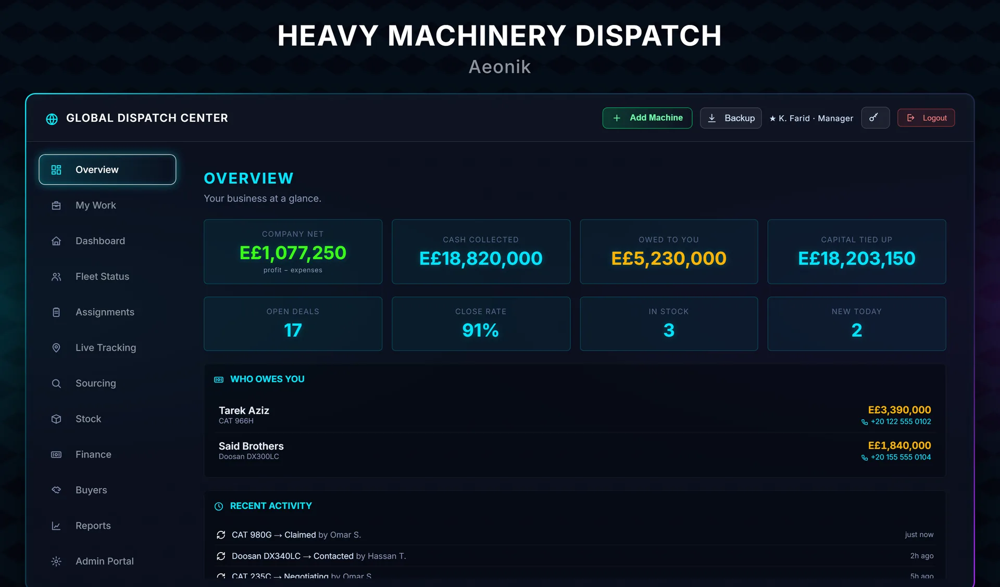
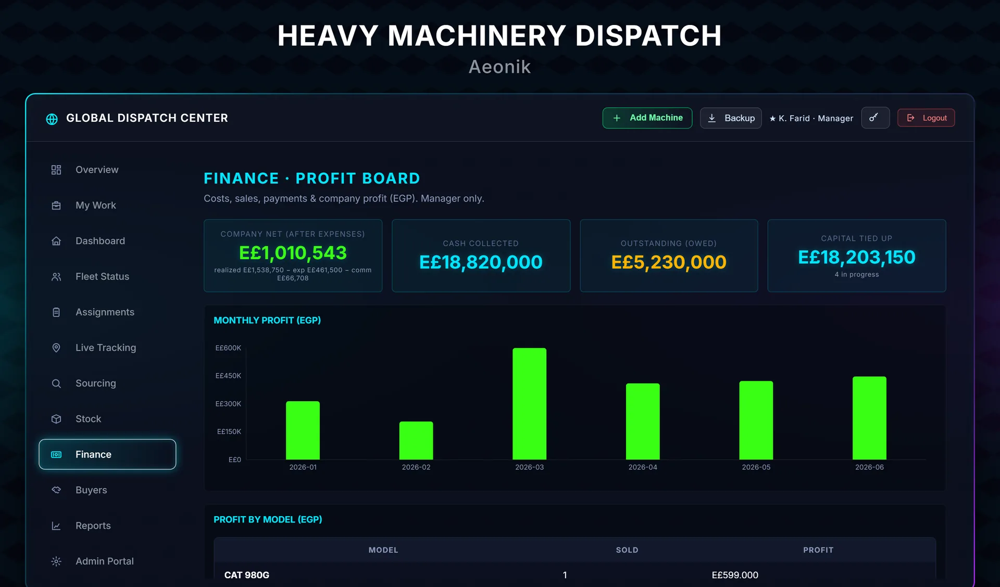

<div align="center">

# Heavy Machinery Dispatch

**A full-stack operations platform for a heavy-equipment trading business:
scrape international marketplaces for specific machines, push each find to one
operator on Telegram, and run every deal from first contact to final profit —
Python / FastAPI backend, React dashboard.**

</div>

<div align="center">


</div>

> **Demo build.** This is a portfolio version. All names, phone numbers and figures
> in the screenshots are sample data; live credentials, the production database and
> the client's identity are not part of this repository. `.env.example` files show
> the configuration shape without any secrets.

---

## The problem it solves

A heavy-equipment trader buys specific machines (CAT, Doosan, …) from marketplaces
in the USA, Canada, Europe and Australia and resells them in Egypt. Two real pains:

1. **Finding machines meant staff refreshing marketplace sites all day** — and the
   best-priced ones were gone within hours.
2. **Every deal carried a long money trail** — bought abroad in foreign currency,
   freight paid overseas, then customs / clearance / repairs paid locally in EGP,
   then sold in EGP. Working out the true profit per machine by hand was slow and
   error-prone.

This platform automates the finding and does the currency-aware profit maths.

---

## What it does

**Finds machines, continuously.** A pool of scrapers watches the configured
marketplaces for the exact models the business trades. Each genuinely new listing
is pushed to the team on Telegram and assigned to one operator automatically.

**Runs the deal pipeline.** Every machine moves through a fixed set of stages:

```
Active → Claimed → Contacted → Negotiating → Purchased →
Shipping → Customs → In Stock → Sold   (+ Lost / Removed)
```

**Computes real profit.** Per machine it tracks purchase price, overseas freight,
an FX rate to EGP, then local customs, clearance and repair costs — and derives
gross margin per machine and company-wide net (realised profit − expenses), a
figure visible to managers only.

**Handles the rest of the operation:** buyers and who owes what, per-machine
document vault (customs papers, bill of lading, invoices), role-based accounts
(manager vs operator), and nightly database backups.

---

## How it works

### One find → one operator (round-robin)

The scraper and the API share a single round-robin pointer in the database, so
every new listing is assigned to exactly one operator in rotation — no machine is
missed and none is double-assigned.

### Scraping politely, and around geo-blocks

The base scraper rotates User-Agent headers and sleeps a random 2–5 seconds
between requests rather than hammering a source. Some European marketplaces
geo-block the client's region entirely — so for those, the platform runs the
fetch server-side and *mirrors* the listing (photos + seller contact) onto the
dashboard, and the Telegram alert links to the dashboard instead of the blocked
source. Sources needing paid API keys (e.g. eBay's Browse API) join the rotation
only when credentials are present, and are skipped silently otherwise so the
health check doesn't false-alarm on "0 listings".

### Currency-aware profit

Costs land in two currencies. The finance layer stores the foreign purchase and
freight, an `fx_to_egp` rate, and the local EGP costs separately, then reduces
them to one comparable profit figure per machine and rolls them into the
company net.

### Service boundaries

The scraper/notifier runs as a scheduled poller; the dashboard is served by a
FastAPI app with session auth and manager/operator roles. Configuration and the
scrape targets live in `targets.py` and `.env` — data and secrets, never code.

---

## Stack

| | |
|---|---|
| Backend | Python, FastAPI, SQLite |
| Scraping | requests, BeautifulSoup, Playwright, cloudscraper |
| Alerts | Telegram Bot API |
| Frontend | React + Vite |
| Deploy | nginx + systemd, nightly DB backup |

---

## Layout

```
scraper_project/
  main.py              the scrape → dedupe → assign → notify loop
  api.py               FastAPI: auth, pipeline, finance, buyers, documents
  targets.py           which marketplaces & models to watch (config, not code)
  scrapers/            one module per source + a polite base_scraper
  notifications/       Telegram + email notifiers
  db/database.py       schema, round-robin assignment, pipeline, finance maths
  backup_db.py         nightly backup

dashboard/             React + Vite operator/manager UI
  src/components/       Overview, Finance, Assignments, Stock, Sourcing, Buyers…
```

## Running it

Backend:

```bash
cd scraper_project
cp .env.example .env          # fill in your own Telegram token etc.
pip install -r requirements.txt
python api.py                 # dashboard API
python main.py                # run the scrapers once
```

Dashboard:

```bash
cd dashboard
cp .env.example .env
npm install
npm run dev
```

---

Built by **Amir Fouad** — [dija-technologies.com](https://dija-technologies.com) ·
More on GitHub: [cube-crash](https://github.com/amirfouad-dev/cube-crash) ·
[dija-3d-site](https://github.com/amirfouad-dev/dija-3d-site)
